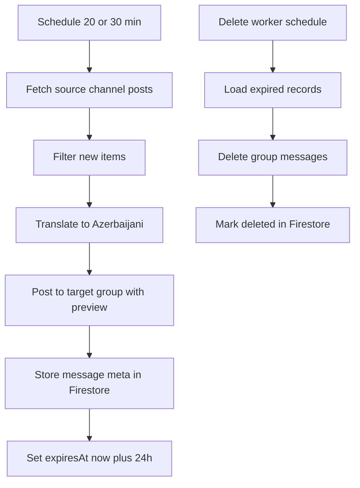

# Telegram Kanal Haberlerini Otomatik Olarak Gruba Aktarma Planı

## 1. Hedef ve Kısıtlar

- Kaynak: Telegram açık kanalındaki haber postları
- Hedef: Kendi Telegram grubuna bot ile gönderim
- Dil: Kaynak Rusça veya İngilizce, hedef Azerbaycanca
- Çeviri başarısız olursa: Mesaj atlanmayacak, orijinal metin gönderilecek
- Tüm yapı ücretsiz olacak
- Her gönderilen haber 24 saat sonra gruptan silinecek
- Ana gruptan doğal görünüm için toplama işi 20 veya 30 dakikada bir çalışacak
- Uygulama JavaScript tabanlı olacak

---

## 2. Ücretsiz Mimari Önerisi

### Bileşenler

- Node.js servis kodu (JavaScript)
- Telegram okuma katmanı
  - Kaynak: `t.me/s/kanal_adi` web sayfasından içerik çekme
  - Yöntem: HTML parse ile post metni, link ve medya bilgisini alma
- Telegram yazma ve silme katmanı
  - Bot API ile gruba gönderim ve zaman dolunca silme
- Firebase Firestore
  - Gönderilen kayıtlar
  - Deduplikasyon için içerik kimliği
  - Silinecek mesaj kuyruğu benzeri kayıt
- GitHub Actions
  - Zamanlanmış iş olarak çalıştırma
  - Sunucu barındırmadan ücretsiz otomasyon

### Neden bu mimari

- Her şey ücretsiz katmanlarda ilerleyebilir
- Sürekli açık sunucu zorunluluğu yok
- Cron zamanlaması güvenilir ve yönetimi kolay
- Firestore ile veri kalıcılığı ve TTL desteği hazır

---

## 3. Akış Tasarımı

---

## 4. Veri Modeli

### Koleksiyon: `news_posts`

Önerilen alanlar:

- `sourceChannelId`
- `sourceMessageId`
- `contentHash`
- `originalText`
- `translatedText`
- `targetChatId`
- `targetMessageId`
- `postedAt`
- `expiresAt`
- `deleteStatus`  

### Deduplikasyon kuralı

- Bir post için `sourceChannelId + sourceMessageId` birincil benzersizlik
- Ek güvenlik için `contentHash`
- Aynı içerik tekrar gelirse gruba yeniden atılmaz

---

## 5. Çeviri Stratejisi

### Ücretsiz yaklaşım

- Birincil: Ücretsiz API sağlayıcıları üzerinden çeviri katmanı
- İkincil: Hata veya kota durumunda orijinal metni gönder
- Dil algısı: Sadece Rusça ve İngilizce kaynak metinleri hedefe çevir

### Sağlamlık

- Çeviri çağrısında timeout
- 1 veya 2 kısa retry
- Hata loglama

---

## 6. Zamanlama Planı

### İş 1: Toplama ve Gönderim

- GitHub Actions cron
- 20 veya 30 dakikada bir tetikleme
- Her çalışmada:
  - Son işlenen mesajdan itibaren yenileri çek
  - Dedupe kontrolü
  - Çeviri ve gönderim
  - Firestore kayıt

### İş 2: 24 Saat Dolan Mesajları Silme

- GitHub Actions cron
- 10 dakikada bir veya 15 dakikada bir tetikleme
- `expiresAt <= now` kayıtları bul
- Telegram üzerinden sil
- Firestore durumunu güncelle

---

## 7. Telegram Tarafı Gereksinimler

- Bot, hedef grupta yönetici olmalı
  - Mesaj gönderme
  - Mesaj silme izni
- Kaynak kanal okuma yöntemi
  - MTProto kullanılmayacak
  - Sadece `t.me/s/kanal_adi` public web görünümünden veri çekilecek
  - HTML yapısı değişirse parser güncellenecek

---

## 8. Güvenlik ve Gizli Bilgiler

- Tüm token ve anahtarlar GitHub Secrets içinde tutulacak
- Firebase servis hesabı JSON bilgisi secret olarak eklenecek
- Loglarda kişisel veri ve token maskelenecek

---

## 9. Ücretsiz Dağıtım ve Operasyon

- Kod deposu: GitHub
- Otomasyon: GitHub Actions ücretsiz kotası
- Veri katmanı: Firebase Spark planı
- İzleme: GitHub Actions run logları + Firestore hata kayıtları

---

## 10. Riskler ve Önlemler

- Ücretsiz çeviri kotası veya erişim dalgalanması
  - Önlem: Fallback olarak orijinal metin gönder
- Telegram rate limit
  - Önlem: Mesaj gönderim aralığına küçük gecikmeler koy
- Firestore TTL anlık silmeyebilir
  - Önlem: Silme worker esas mekanizma, TTL yardımcı katman
- `t.me/s` sayfa yapısı değişebilir
  - Önlem: Parser seçicilerini merkezi dosyada tut ve hata halinde fallback log üret

---

## 11. Uygulama Adımları

1. Proje iskeletini oluştur ve Node.js bağımlılıklarını belirle
2. Firebase projesini aç, Firestore koleksiyonunu hazırla
3. Telegram botu oluştur, gruba admin olarak ekle
4. `t.me/s/kanal_adi` için web scraping okuma modülünü yaz
5. Dedupe ve içerik kimliği katmanını ekle
6. Çeviri katmanını fallback mantığı ile ekle
7. Gönderim sonrası `expiresAt` ile kayıt akışını tamamla
8. Silme worker modülünü yaz ve test et
9. GitHub Actions cron işlerini ekle
10. Uçtan uca test ve hata senaryolarını doğrula
11. Operasyon notlarını ve runbook dosyasını hazırla

---

## 12. Kabul Kriterleri

- Haberler planlanan aralıkta otomatik çekiliyor
- Grup gönderimlerinde preview davranışı doğru
- Rusça ve İngilizce metinler Azerbaycancaya çevriliyor
- Çeviri başarısız olsa bile mesaj atlanmıyor
- Gönderilen mesajlar 24 saat civarında otomatik siliniyor
- Tekrar eden içerikler yeniden gönderilmiyor
- Tüm sistem ücretsiz katmanda çalışıyor

---

## 13. Bir Sonraki Adım

Bu plan onaylandıktan sonra `code` moduna geçip şu sırayla ilerlenir:

- Proje dosyalarının oluşturulması
- Firebase entegrasyonu
- Telegram gönderim ve silme akışı
- Çeviri ve fallback
- GitHub Actions cron kurulumu
